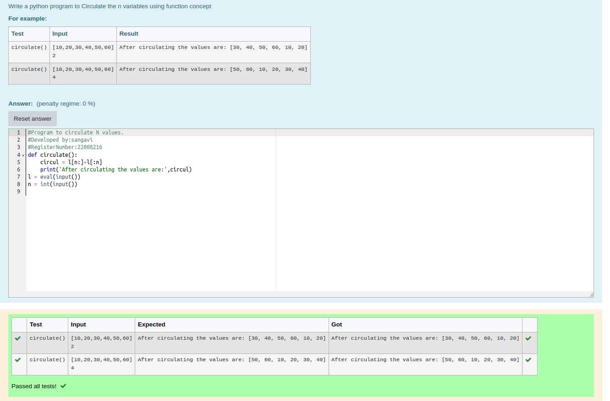

# Circulate-the-values-of-N-variables
## Aim:

To write a python program to circulate the n variables using function concept

## Equipment’s required:

PC
Anaconda - Python 3.7

## Algorithm: 

### Step 1:
get n variable from the user
### Step 2: 
get the input
### Step 3: 
Get the value from the user for the number of rotation
### Step 4: 
Using the slicing concept rotate the list
### Step 5: 
print the values it would be interchanged
### Step 6: 
end the program

## Program:
```python
#Program to circulate N values.
#Developed by:sangavi 
#RegisterNumber:22008216
def circulate():
    circul = l[n:]+l[:n]
    print('After circulating the values are:',circul)
l = eval(input())
n = int(input())
```

## Output:


## Result:
thus the circulation of n variable sussessfully executed